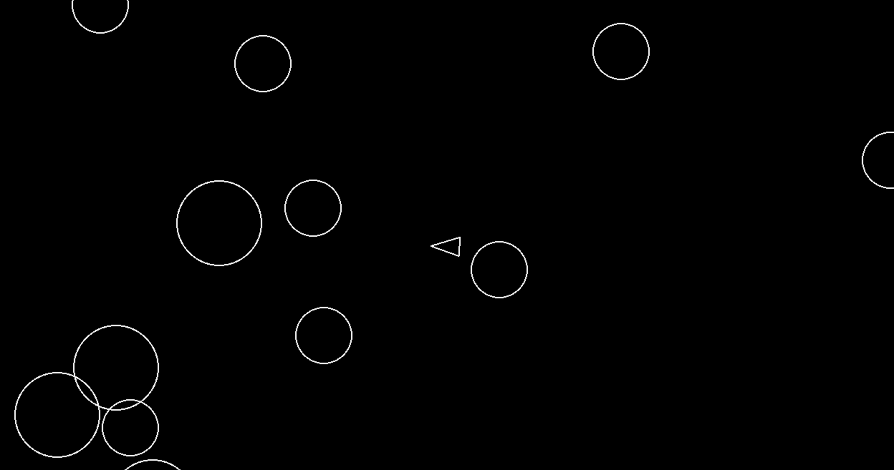

# Asteroids

A classic Asteroids-inspired arcade game built with Python and Pygame.

This project was created to practice:
- Object-oriented programming (OOP)
- Game loops
- Sprite systems
- Vector math and rotation
- Real-time keyboard input
- circle-based collision system

---

## Preview

## Features

- Player-controlled spaceship with rotation and forward/backward movement
- Real-time keyboard controls using `A`, `D`, `W`, `S`, and `Space`
- Projectile shooting with a cooldown system
- Random asteroid spawning from screen edges
- Moving asteroids with variable size, speed, and direction
- Circle-based collision detection between player, asteroids, and shots
- Asteroids split into smaller pieces when shot
- Game over condition when the player collides with an asteroid
- Sprite groups for updating, drawing, asteroids, and shots
- Delta-time based movement for smoother frame-independent gameplay

---

## Technologies Used

- Python 3
- Pygame

---

## Installation

### Clone the repository

bash git clone https://github.com/Ha0cH/Asteroids.git
cd Asteroids

### Create and activate a virtual environment

bash python -m venv .venv source .venv/bin/activate 

On Windows:

bash .venv\Scripts\activate 

### Install dependencies

bash pip install pygame 

---

## Run the Game

bash python main.py 

or with uv:

bash uv run main.py 

---

## Controls

| Key | Action |
|---|---|
| W | Move forward |
| S | Move backward |
| A | Rotate left |
| D | Rotate right |
| Space | Shoot |

---

## What I Learned

Through this project, I practiced:
- Class inheritance
- Method overriding
- Delta-time game loops
- Pygame rendering
- Sprite-based architecture
- Git and GitHub workflows
- Python type hints

---

## Future Improvements

- Add a scoring system
- Implement multiple lives and respawning
- Add an explosion effect for the asteroids
- Add acceleration to the player movement
- Make the objects wrap around the screen instead of disappearing
- Add a background image
- Create different weapon types
- Make the asteroids lumpy instead of perfectly round
- Make the ship have a triangular hit box instead of a circular one
- Add a shield power-up
- Add a speed power-up
- Add bombs that can be dropped

---

## License

This project is for educational purposes.